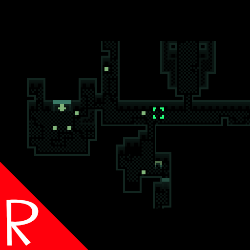

# Quasimorph MiniMapMoveCamera

Adds the ability to click the mini map with the middle mouse button to move the view to that location.  
Double click to move to that location and close the map.

The mouse or keyboard key can be remapped in the configuration file.  Note that Right Mouse Button is currently used by the Map Markers mod.

# Configuration

## MCM
This mod supports the Mod Configuration Menu. Some values can be set in the Mods menu, while others can only be changed in the config file.

## Config File

The configuration file will be created on the first game run and can be found at `%AppData%\..\LocalLow\Magnum Scriptum Ltd\Quasimorph_ModConfigs\MiniMapMoveCamera\config.json`.

|Name|Default|Description|
|--|--|--|
|MoveCameraKey|Middle Mouse Button (Mouse2)|The button to click to move the view to the mini map's position.|
|DoubleClickTime|250|The maximum time, in milliseconds, that can elapse between two consecutive clicks to be considered a double-click.|

## Key List
The list of valid keyboard keys can be found  at the bottom of https://docs.unity3d.com/ScriptReference/KeyCode.html
Beware that numbers 0-9 are Alpha0 - Alpha9.  Most of the other keys are as expected such as X for X.
Use "None" to not bind the key.

# Buy Me a Coffee
If you enjoy my mods and want to buy me a coffee, check out my [Ko-Fi](https://ko-fi.com/nbkredspy71915) page.
Thanks!

# Source Code
Source code is available on GitHub at https://github.com/NBKRedSpy/MiniMapMoveCamera

# Credis
* Special thanks to Crynano for his excellent Mod Configuration Menu. 
